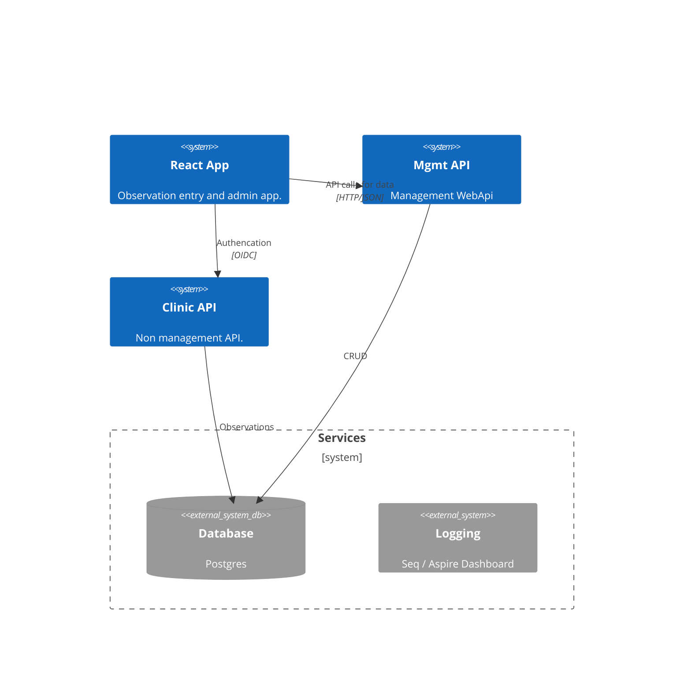

# ABC

ABC data collection for ABA therapists and parents of kids with special needs.

# Cloud Native Development with .NET

This repo will show different approaches to doing development that will target cloud native deployments.

## Solution Overview



## Building Container Images

The easiest way to build container images for the ASP.NET Core
projects is to use `dotnet publish` with the `PublishContainer` option.

This requires that the `csproj` files for the API, WebApp, and Identity
projects have the following properties:

```xml
  <IsPublishable>true</IsPublishable>
  <EnableSdkContainerSupport>true</EnableSdkContainerSupport>
```

To build the container images, you would run a command like the
following from the folder containing the ASP.NET Core project:

```bash
dotnet publish --os linux /t:PublishContainer
```

Optional parameters (use each with `-p name=value` syntax or as
properties in the `csproj` file):

* `ContainerRepository`: Name of the container with namespace or other folders. Examples: `carvedrock/carvedrock-api`, `dahlsailrunner/carvedrock-api`
* `ContainerTag`: Specify a tag for the container image. Nice to use a BuildNumber or something like that.
* `ContainerTags`: Alternative to the `ContainerTag` parameter. Use this to specify multiple tags (separated by `;`) for the container image.
* `ContainerRegistry`: Name for the registry the image will be published to - when provided it will push the image to the specified registry.  **NOTE: You need to be authenticated to the registry with `docker login` somehow when providing this value.**
* `ContainerBaseImage` Specific base image to use when building the container.
* `ContainerFamily`: Specify a family name rather than exact base image (e.g. `alpine`).  Ignored if `ContainerBaseImage` is set.

Example for the API project (run from the `CarvedRock.Api` folder):

```bash
dotnet publish --os linux /t:PublishContainer -p ContainerRepository=dahlsailrunner/carvedrock-api -p ContainerFamily=alpine
```

Here's a second example that would push to a registry after building the image:

```bash
dotnet publish --os linux /t:PublishContainer -p ContainerRegistry=docker.io -p ContainerRepository=dahlsailrunner/carvedrock-api -p ContainerFamily=alpine
```

### Line Separators

In `bash` (linux) terminals, you can use `\` as a line separator:

```bash
dotnet publish --os linux /t:PublishContainer \
  -p ContainerRepository=dahlsailrunner/carvedrock-api \
  -p ContainerFamily=alpine
```

In PowerShell, you can use the backtick (`) as a line separator:

```powershell
dotnet publish --os linux /t:PublishContainer `
  -p ContainerRepository=dahlsailrunner/carvedrock-api `
  -p ContainerFamily=alpine
```

### Pipeline YAML

Here is a YAML task that you could use in an Azure DevOps pipeline
to build and publish a container image:

```yaml
- task: DotNetCoreCLI@2
  displayName: 'Publish container image'
  inputs:
    command: 'publish'    
    arguments: >-
      --os linux 
      --arch x64 
      /t:PublishContainer 
      -p ContainerRegistry=registry.yourcompany.com 
      -p ContainerRepository=yourteam/carvedrock-api
      -p ContainerImageTag=$(Build.BuildId)
  env:
    SDK_CONTAINER_REGISTRY_UNAME: 'svc_account_for_pipelines'
    SDK_CONTAINER_REGISTRY_PWORD: $(DOCKER_PASSWORD)
```

#### More Information

* [Publishing container images](https://learn.microsoft.com/en-us/dotnet/core/docker/publish-as-container?pivots=dotnet-8-0#publish-net-app): Includes information about all of the different parameters you can use
* [.NET Container images](https://learn.microsoft.com/en-us/dotnet/core/docker/container-images): More about the different images that are available for various scenarios
* [ASP.NET Core Full Tag Listing](https://mcr.microsoft.com/product/dotnet/aspnet/tags): Listing of all the different base images available for ASP.NET Core

### Using the Docker CLI

I find that the SDK-based approach (`dotnet publish`) is easier and I like the simplicity
of not needing any of the Docker-related files in the repo.  But this may not be the approach
you want to take, for any number of reasons.

If you want to use `docker build` to build container images,
you would need to include a `Dockerfile` in each project folder
for the ASP.NET Core projects, plus a `.dockerignore` file
in the root of the solution.

The Dockerfile would specify the base image that you would
use to build the image.  See the `Dockerfile` in
the `containers/CarvedRock.Api` as an example.

The commands to build and push the API container image are as follows and should be
run from the `containers` folder.

```bash
docker build -t dahlsailrunner/carved-rock-api -f CarvedRock.Api/Dockerfile .

docker push dahlsailrunner/carved-rock-api  # will go to docker.io (assuming you're logged in)
```

Pushing this image to a container registry with a single `build` command can be done
by adding the `--push` argument.  Note that the default registry is `docker.io`.
To use a different registry all from this single command add the registry to the
beginning of the tag name.  For example:

```bash
docker build --push -t registry.mycompany.com/dahlsailrunner/carved-rock-api -f CarvedRock.Api/Dockerfile .
```

Note that you need to have already done a `docker login` to any registry you're pushing to.

## Open Telemetry Configuration

Open Telemetry includes logging, tracing, and metrics.

Details for each of these areas and general configuration
is provided by a handful of environment variables or
other configuration values - here's a sample:

```yaml
OTEL_EXPORTER_OTLP_ENDPOINT: http://localhost:4317
OTEL_METRICS_EXPORTER: otlp
OTEL_LOGS_EXPORTER: otlp
OTEL_BLRP_SCHEDULE_DELAY: '1000'
OTEL_BSP_SCHEDULE_DELAY: '1000'
OTEL_DOTNET_EXPERIMENTAL_ASPNETCORE_DISABLE_URL_QUERY_REDACTION: 'true'
OTEL_DOTNET_EXPERIMENTAL_HTTPCLIENT_DISABLE_URL_QUERY_REDACTION: 'true'
OTEL_DOTNET_EXPERIMENTAL_OTLP_EMIT_EVENT_LOG_ATTRIBUTES: 'true'
OTEL_DOTNET_EXPERIMENTAL_OTLP_EMIT_EXCEPTION_LOG_ATTRIBUTES: 'true'
OTEL_DOTNET_EXPERIMENTAL_OTLP_RETRY: in_memory
OTEL_METRICS_EXEMPLAR_FILTER: trace_based
OTEL_METRIC_EXPORT_INTERVAL: '1000'
OTEL_EXPORTER_OTLP_PROTOCOL: grpc
OTEL_RESOURCE_ATTRIBUTES: service.version=1.0.0,service.namespace=carvedrock,deployment.environment=local,service.instance.id=<containerid>
OTEL_SERVICE_NAME: carvedrock-api
OTEL_TRACES_SAMPLER: always_on
```

To see the values configured when running projects from
an Aspire AppHost, set a breakpoint in a `Program.cs`
file after the `WebApplication.CreateBuilder()` call
is made (or after you've loaded configuration).

Then review the `IConfiguration` instance for all
of the `OTEL_*` configuration keys.

Here are some reference locations for more details
about possible configuration options:

* [General envrionment variables reference for .NET OpenTelemetry](https://github.com/open-telemetry/opentelemetry-dotnet/blob/main/src/OpenTelemetry.Exporter.OpenTelemetryProtocol/README.md#environment-variables)
* [Details about the `OTEL_RESOURCE_ATTRIBUTES` options](https://opentelemetry.io/docs/specs/semconv/resource/)
* [How sampling works](https://opentelemetry.io/docs/specs/otel/trace/sdk/#sampling)
* [How to set sampling-related configuration](https://github.com/open-telemetry/opentelemetry-specification/blob/main/specification/configuration/sdk-environment-variables.md)

### Testing an Open Telemetry Service Locally

A simple extension method called `WithOtherOpenTelemetryService` has been
added to the AppHost code in `LoggingHelper.cs`.

Calls to this method can be commented in / enabled in
`Program.cs` of the AppHost to send local Open Telemetry
data to a different place than the Aspire Dashboard.

You'll need to provide the `OTEL_EXPORTER_OTLP_ENDPOINT`
value for your service in the `WithOtherOpenTelemetryService` method, and if that
endpoint requires authorization, provide the
`OTEL_EXPORTER_OTLP_HEADERS` value in the user secrets
for the AppHost under the key of `ApmServerAuth`,
something like this:

```json
  "ApmServerAuth": "Authorization=Bearer yourtokenvalue"
```

**N O T E:** This method is provided for simple testing
of an Open Telemetry service and your configuration of
it.  In general, you should use the Aspire Dashboard
locally - it's really fast, and it's only your data - not
your teammates'.  But this method can help you confirm
your deployment setup and configuration before you
actually deploy.

### Popular Services for Open Telemetry

Many of the services below will allow you to start for free.  Make sure to understand pricing at the level
of scale you require - this can be data storage,
number of users that need access to the platform,
number of transactions sent, or other factors.

* [Elastic APM](https://www.elastic.co/observability/application-performance-monitoring): Elastic integrates with OpenTelemetry, allowing you to reuse your existing instrumentation to send observability data to the Elastic Stack.
* [Datadog](https://www.datadoghq.com/): Datadog supports OpenTelemetry for collecting and visualizing traces, metrics, and logs.
* [New Relic](https://newrelic.com/): New Relic offers support for OpenTelemetry, enabling you to send telemetry data to their platform.
* [Splunk](https://www.splunk.com/): Splunk's Observability Cloud supports OpenTelemetry for comprehensive monitoring and analysis.
* [Honeycomb](https://www.honeycomb.io/): Honeycomb integrates with OpenTelemetry to provide detailed tracing and observability.

### Running a Docker Image Locally

First, build the container image:

```powershell
dotnet publish --os linux /t:PublishContainer `
  -p ContainerRepository=carvedrock-api
```

Then, run it with the various environment variables set:

```powershell
docker run -d --name cr-api `
-p 8080:8080 `
-e ConnectionStrings__CarvedRockPostgres="Host=34.56.7.194;Database=carvedrock;Username=postgres;Password=0JA}mP-UDxS9}#Gq;" `
-e OTEL_EXPORTER_OTLP_ENDPOINT="https://0146b894b1694cbc8d202a83a14e1efb.apm.us-central1.gcp.cloud.es.io:443" `
-e OTEL_EXPORTER_OTLP_HEADERS="Authorization=Bearer RaemoVEmPNVMlSAwRv" `
-e OTEL_METRICS_EXPORTER=otlp `
-e OTEL_LOGS_EXPORTER=otlp `
-e OTEL_BLRP_SCHEDULE_DELAY='1000' `
-e OTEL_BSP_SCHEDULE_DELAY='1000' `
-e OTEL_DOTNET_EXPERIMENTAL_ASPNETCORE_DISABLE_URL_QUERY_REDACTION='true' `
-e OTEL_DOTNET_EXPERIMENTAL_HTTPCLIENT_DISABLE_URL_QUERY_REDACTION='true' `
-e OTEL_DOTNET_EXPERIMENTAL_OTLP_EMIT_EVENT_LOG_ATTRIBUTES='true' `
-e OTEL_DOTNET_EXPERIMENTAL_OTLP_EMIT_EXCEPTION_LOG_ATTRIBUTES='true' `
-e OTEL_DOTNET_EXPERIMENTAL_OTLP_RETRY=in_memory `
-e OTEL_METRICS_EXEMPLAR_FILTER=trace_based `
-e OTEL_METRIC_EXPORT_INTERVAL='1000' `
-e OTEL_EXPORTER_OTLP_PROTOCOL=grpc `
-e OTEL_RESOURCE_ATTRIBUTES=service.version=1.0.0,service.namespace=carvedrock,deployment.environment=local,service.instance.id=erik `
-e OTEL_SERVICE_NAME=carvedrock-api `
-e OTEL_TRACES_SAMPLER=always_on `
carvedrock-api
```

Finally, open a browser to [http://localhost:8080/product](http://localhost:8080/product)

Check your Open Telemetry logs / trace!

## Deploying to Azure Container Apps

> **NOTE:** There are a couple of "issues" resolved in here
> from that would apply even to deploying to Kubernetes or
> other targets that want or need to take advantage of
> an `aspire-manifest.json` that's as accurate as possible.

### Prerequisites

1. Make sure you have the Azure CLI installed. (`winget install Microsoft.Azd`)
1. Ensure you have some kind of Azure subscription where you have permission
to create resources (Visual Studio/MSDN subscriptions often come with free Azure credits)
1. Login to your Azure subscription from the CLI using `azd auth login`.

### Deployment

It's pretty much as simple as two commands (from the AppHost project directory):

```bash
azd init  ## this is a one time step
azd up  ## do this when you want to push updates
```

`azd init` will prompt you for an enviornment name (like `dev` or `prod`).
It will also generate a `next-steps.md` file that you can review.

Then `azd up` will prompt you for the Azure subscription and region to use,
and provision and deploy your app!

> **TIP:** To deploy a single service that you've changed, just do:
> `azd deploy <service-name>`

#### Removing a Deployment

If you're done with a deployment to Azure Container Apps and no longer
need it, removing it is as simple as:

```bash
azd down  # will remove everything - including the resource group!
```

### Deployment Issues

For this particular solution / application, there were a couple
of things that needed to be updated in the code to get this deployed
in a fully working state.

#### Externally Available Services

The first issue was that the services (https endpoints) were not
available externally. This is by design and a good thing.  For any
services you want to be able to reach from a browser, you need to add
the `WithExternalHttpEndpoints()` method to those services in your
`AppHost` code.

***Only make endpoints available externally if they need to be.*** Our
API, for example, does NOT need to be available externally for the app
to work.

#### Database Migrations and Data

The second issue was **database migrations and initial data**. You'll
have to have a way to apply migrations and possibly populate some
initial data to your database. The solution within this demo application
was to loosen the "development-only" conditionals for applying
migrations and creating some initial data.

***Just make sure you have a way to apply migrations and create any
seed / initial data you need.***

#### IdentityServer

This application uses a sample - read: not production-ready - of Duende
IdentityServer with hard-coded users, configuration, and very simple key
management.  To make this work in a deployed environment, we needed to
have the container run as root (see the `.csproj` file) so that it had
permissions to write the key files (these would normallly be stored in
the database), and we also had to add the URI for the deployed webapp
as an allowed redirect to the hard-coded configuration for the client app.

### Documentation

* [Deploy Aspire to ACA](https://learn.microsoft.com/en-us/dotnet/aspire/deployment/azure/aca-deployment)
* [Deploy with azd (in-depth)](https://learn.microsoft.com/en-us/dotnet/aspire/deployment/azure/aca-deployment-azd-in-depth)
* [Deploying using Pipelines](https://learn.microsoft.com/en-us/dotnet/aspire/deployment/azure/aca-deployment-github-actions?pivots=github-actions)

### Seeing Some Internals

To get some insight into what is actually being provisioned, try the following:

* Explore the already-generated `.azure` folder
* Look at `azure.yaml`

```powershell
azd config set alpha.infraSynth on   ## only needed one time
azd infra synth
```

Explore the `infra` folder.

#### Aspire Manifest

To see the manifest that the `azd` CLI (and other tooling) uses to see the application
setup, run the following command:

```powershell
dotnet run --project CarvedRock-Aspire.AppHost.csproj --output-path manifest.json --publisher manifest
```

### Production Concerns

#### Persistent Azure Services

Our application uses a Postgres database as one of its
services, and while that is fine for local dev and early
test environments -- and may even be super beneficial due to lower cost --
it's more common for production (and often
at least one test environment before production) to use a
persistent and highly available service.

There ARE Aspire hosting methods that can target and provision
various Azure services:

```csharp
var postgresdb = builder.AddPostgres("postgres")
                       .AddDatabase("CarvedRockPostgres");
```

would be replaced with:

```csharp
var postgresdb = builder.AddAzurePostgresFlexibleServer("postgres")
                       .AddDatabase("CarvedRockPostgres");
```

Or maybe even:

```csharp
var postgres = builder.ExecutionContext.IsPublishMode 
  ? builder.AddAzurePostgresFlexibleServer("postgres")
  : builder.AddPostgres("postgres");

var postgresdb = postgres.AddDatabase("CarvedRockPostgres");
```

More information: [https://learn.microsoft.com/en-us/dotnet/aspire/database/postgresql-entity-framework-integration?tabs=dotnet-cli](https://learn.microsoft.com/en-us/dotnet/aspire/database/postgresql-entity-framework-integration?tabs=dotnet-cli)

#### Conditional Services

Our dev email server (`rnwood/smtp4dev`) is a fake email server that
we should only use for local development and early testing environments.
In higher testing environments and production we would want to use a real
email service.

For situations like this it may be best to use the Aspire-based deployments
ONLY for environments where you want it more fully deployed, and then
for higher environments you would simply build container images (see [above](#building-container-images))
and deploy them with the configuration they need.

## Deployment to Kubernetes with Aspir8

* [Aspir8 Docs](https://prom3theu5.github.io/aspirational-manifests/getting-started.html)
* [Aspir8 GitHub repo](https://github.com/prom3theu5/aspirational-manifests)

```bash
dotnet tool install -g aspirate --prerelease

aspirate init # from apphost directory

aspirate build # build container images - choose what you want to include

aspirate generate # generates k8s manifests, can also build: use --skip-build 

aspirate apply # choose k8s context (cluster)

aspirate destroy
```

`build` creates (and pushes if registry set) images using the `dotnet publish`
approach.

More efficient than the `kubectl` CLI:

* [k9s](https://k9scli.io/): Terminal-based UI
* [Lens](https://k8slens.dev/): Full UI (free individually, licensed for companies with more than $10M in annual revenue)
* [Headlamp](https://headlamp.dev/): Full UI - open source, completely free

Can use "port forwarding" to see the services.

[Aspire service discovery](https://learn.microsoft.com/en-us/dotnet/aspire/service-discovery/overview) can help resolve certain container-to-container networking
issues.

### Ingress

Cloud providers usually have some kind of "built-in" or "preferred" ingress
controller that will provide free https certificates (and management / rotation).
Recommend using them.  Like what we saw with Azure Container Apps.

Get an ingress controller - nginx is a common one.

[https://kubernetes.github.io/ingress-nginx/deploy/#quick-start](https://kubernetes.github.io/ingress-nginx/deploy/#quick-start)

```bash
kubectl apply -f https://raw.githubusercontent.com/kubernetes/ingress-nginx/controller-v1.12.0-beta.0/deploy/static/provider/cloud/deploy.yaml
```

### Generate "Initial" Kubernetes manifests

```powershell
aspirate generate --output-path=./k8s --namespace=carvedrock --image-pull-policy IfNotPresent --disable-secrets --include-dashboard false 
```

Choose the services you want.  Eliminate command line options and provide them interactively if you like.

Then make updates to the files in prep for a real deployment.

I updated:

* Added resource limits in `deployment.yaml` files with copilot (starting points for them, anyway)
* Added `ingress.yaml` file to `webapp` and updated `kustomization.yaml` to include it
* Removed the `ConnectionStrings__CarvedRockPostgres` value from the api `kustomization.yaml` file (it
was added since I disabled secret handling)
* Add the various non-secret `OTEL` value to the `kustomization` files for the web app and the api:

```yaml
    - OTEL_SERVICE_NAME=carvedrock-api
    - OTEL_RESOURCE_ATTRIBUTES=service.version=1.0.0,service.namespace=carvedrock,deployment.environment=local
    - OTEL_EXPORTER_OTLP_ENDPOINT=https://0146b894b1694cbc8d202a83a14e1efb.apm.us-central1.gcp.cloud.es.io
    - OTEL_METRICS_EXPORTER=otlp
    - OTEL_LOGS_EXPORTER=otlp
    - OTEL_BLRP_SCHEDULE_DELAY=1000
    - OTEL_BSP_SCHEDULE_DELAY=1000
    - OTEL_DOTNET_EXPERIMENTAL_ASPNETCORE_DISABLE_URL_QUERY_REDACTION=true
    - OTEL_DOTNET_EXPERIMENTAL_HTTPCLIENT_DISABLE_URL_QUERY_REDACTION=true
    - OTEL_DOTNET_EXPERIMENTAL_OTLP_EMIT_EVENT_LOG_ATTRIBUTES=true
    - OTEL_DOTNET_EXPERIMENTAL_OTLP_EMIT_EXCEPTION_LOG_ATTRIBUTES=true
    - OTEL_DOTNET_EXPERIMENTAL_OTLP_RETRY=in_memory
    - OTEL_METRICS_EXEMPLAR_FILTER=trace_based
    - OTEL_METRIC_EXPORT_INTERVAL=1000
    - OTEL_EXPORTER_OTLP_PROTOCOL=grpc    
    - OTEL_TRACES_SAMPLER=always_on
```

Manually apply namespace (it's a one-time thing) to be able to create secrets in the namespace:

```bash
kubectl apply -f ./k8s/namespace.yaml
```

Create a secret for the postgres database connection string and another for the OTEL remote service token:

```bash
kubectl create secret generic postgres-connstr -n carvedrock --from-literal=ConnectionStrings__CarvedRockPostgres="Host=34.56.7.194;Database=carvedrock;Username=postgres;Password=0JA}mP-UDxS9}#Gq;"

kubectl create secret generic otel-token -n carvedrock --from-literal=OTEL_EXPORTER_OTLP_HEADERS="Authorization=Bearer RaemoVEmPNVMlSAwRv"
```

Add a reference to the secrets in the `-envFrom` section of the deployment manifests:

```yaml
        envFrom:
        - configMapRef:
            name: carvedrock-api-env
        - secretRef:
            name: postgres-connstr
```

Apply!

```bash
kubectl apply -k ./k8s
```

To remove everything:

```bash
kubectl delete -k ./k8s
```

### Deployment Pipeline

* Get k8s files
* Replace build number (tag number) in deployments
* Apply namespace yaml
* Create secrets
* `kubectl apply -k ./k8s`

